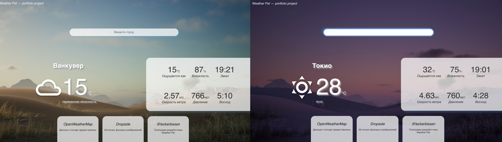

# Simple Weather App

This app allows you to get Weather information about certain City (Town). Coded by React and JavaScript.

## How it works

### API - OpenWeatherMap

1. User enters the City name in the search input.
2. App sends a request to the service OpenWeatherMap by API.
3. *Magic*
4. App displays Weather information for the current day.

### Small Features

* The background picture depends on the time of day in the searched City.
* Responsive layout.
* Some visual effects on search input and footer.
## How to install ##

Install dependencies
> npm install

Run the app
> npm run start

app runs on http://localhost:3000

The app is also available via [this link](https://leckerbissen.github.io/).

## Some more important information ##
* API - [OpenWeatherMap](https://openweathermap.org/api).
* Background pictures from site - [Dynamic Wallpaper Club](https://dynamicwallpaper.club/wallpaper/a9q1jiy0cu).
* Author - Linkova Iuliia. My [telegram account](https://t.me/leckerbissen).
* There is a frog on favicon, cause when I started this project that was Wednesday, dudes.
